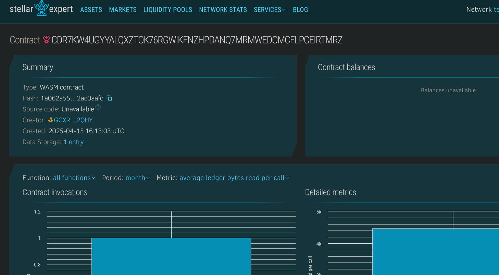

# 2FA with Blockchain Backup

## Project Description
2FA with Blockchain Backup is an innovative authentication system that enhances traditional two-factor authentication (2FA) by leveraging blockchain technology as a secure backup mechanism. This solution addresses the critical recovery problem in conventional 2FA systems where users can be permanently locked out of their accounts if they lose their authentication device. By storing authentication recovery data on the blockchain, users can securely regain access to their accounts without compromising security.

## Project Vision
Our vision is to revolutionize the two-factor authentication landscape by creating a more resilient, user-friendly system that eliminates the single point of failure present in traditional 2FA solutions. By implementing blockchain technology as a secure backup layer, we aim to increase 2FA adoption rates while maintaining the highest security standards. This project bridges the gap between security and convenience, ensuring users never lose access to their critical accounts while still benefiting from the protection that strong authentication provides.

## Key Features
- **Secure 2FA Implementation**: Standard two-factor authentication using time-based one-time passwords (TOTP)
- **Blockchain Recovery System**: Encrypted recovery keys stored on the blockchain
- **Decentralized Backup**: No central authority controlling recovery keys
- **User-Controlled Access**: Recovery process requires multiple verification steps controlled by the user
- **Timelock Mechanisms**: Configurable waiting periods for recovery to prevent unauthorized access attempts
- **Cross-Platform Support**: Compatible with existing 2FA applications and services
- **Privacy-Preserving Design**: Recovery data is encrypted and only accessible by the legitimate user
- **Tamper-Proof Audit Trail**: All recovery attempts are logged on the blockchain for security analysis

## Future Scope
- **Multi-Signature Recovery**: Require approval from trusted contacts for recovery operations
- **Integration with Popular Services**: Plugins for major platforms like Google, Microsoft, and social media
- **Hardware Wallet Support**: Direct integration with hardware security devices
- **Biometric Verification Layer**: Additional verification using fingerprint or facial recognition
- **Enterprise Solutions**: Custom deployments for organizations with specialized security requirements
- **Mobile Application**: Dedicated app for streamlined recovery process
- **Identity Verification Network**: Expanded functionality for general digital identity verification
- **Smart Contract Insurance**: Automated compensation if the recovery system fails
- **Quantum-Resistant Encryption**: Updates to maintain security against future computational threats

## Contract Details:
CDR7KW4UGYYALQXZTOK76RGWIKFNZHPDANQ7MRMWEDOMCFLPCEIRTMRZ
